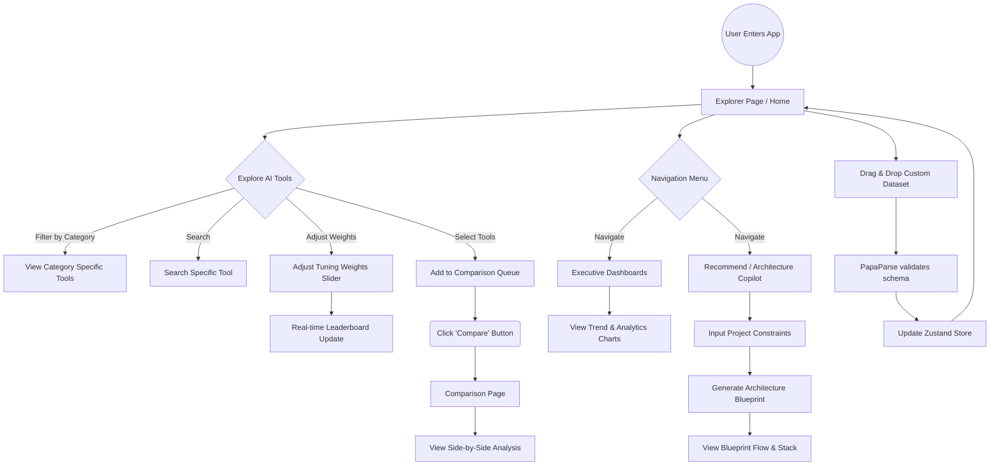

# User Flow Diagram

The following diagram illustrates the primary user journeys and interactions within the AI Stack Explorer 2026 application.

## Application User Journey

## Key Flows Explained

1. **Exploration & Tuning Flow:** The core experience revolves around the `Explorer Page`. Users can filter through tools, but more importantly, use the dynamic sliders to adjust the weights of various criteria (e.g., Security, Cost). This instantly re-ranks the tools on the page via the `Zustand` store.
2. **Architecture Generation Flow:** Users navigate to the `Recommend Page`, input specific project constraints (like Budget, Cloud Host), and the system's "Copilot" logic algorithmically generates a recommended tool stack, mapped across different architectural layers (LLM, Vector DB, Orchestration).
3. **Comparison Flow:** Across the application, users can flag specific tools to be added to their "Compare Queue". Once ready, navigating to the `Comparison Page` provides a comprehensive, side-by-side metric breakdown of the selected tools.
4. **Data Injection Flow:** Power users can inject their own `.csv` data directly into the browser, which bypasses a backend database entirely, merging the local state with the newly uploaded data for immediate analysis.
