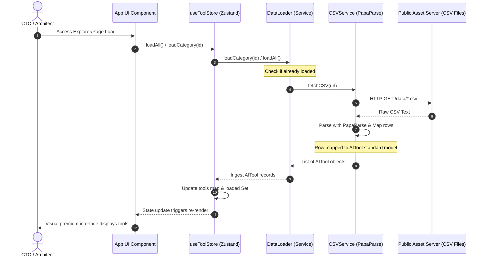
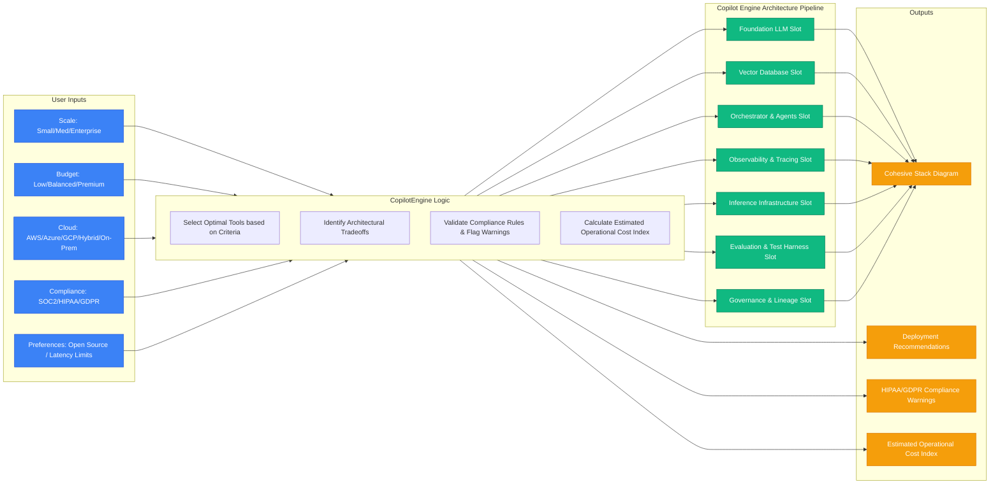

# Enterprise AI Engineering Intelligence Platform (V2)
## System Architecture & Technical Specification Document

This document provides a comprehensive technical overview of the architecture, directory structure, data models, state management, and algorithmic pipelines of the **AI Stack Explorer 2026 (Version 2)**. 

---

## 🏛️ System Architecture Overview

The application is built on a decoupled, multi-layered frontend architecture utilizing React (v19) and TypeScript. It leverages **Zustand** for state management, **Vite** as the build engine, and **TailwindCSS (v4)** for high-fidelity styling. 

```mermaid
graph TD
    %% Styling
    classDef page fill:#3b82f6,stroke:#1d4ed8,stroke-width:2px,color:#fff;
    classDef store fill:#8b5cf6,stroke:#6d28d9,stroke-width:2px,color:#fff;
    classDef service fill:#10b981,stroke:#047857,stroke-width:2px,color:#fff;
    classDef asset fill:#f59e0b,stroke:#d97706,stroke-width:2px,color:#fff;
    classDef component fill:#ec4899,stroke:#be185d,stroke-width:2px,color:#fff;

    subgraph Client [Client UI Layer]
        Router[HashRouter]
        Layout[AppLayout]
        Sidebar[Grouped Accordion Sidebar]
        TopBar[TopBar & CSV Uploader Button]
        
        Explorer[Explorer Page]:::page
        Dashboard[Dashboard Page]:::page
        Recommend[Recommend Page]:::page
        Compare[Comparison Page]:::page
        
        ToolCard[ToolCard / ToolTable]:::component
        WeightsPanel[ScoringWeightsPanel]:::component
        UploadModal[DatasetUploadModal]:::component
        CopilotUI[Blueprint Flow Visualizer]:::component
    end

    subgraph State [Zustand Stores]
        ToolStore[useToolStore]:::store
        WeightsStore[useScoringStore]:::store
        FilterStore[useFilterStore]:::store
        CompareStore[useComparisonStore]:::store
        BookmarkStore[useBookmarkStore]:::store
        UIStore[useUIStore]:::store
    end

    subgraph Services [Infrastructure Services]
        Loader[DataLoader]:::service
        CSV[CSVService / PapaParse]:::service
        Exporter[ExportService]:::service
        CopilotEng[CopilotEngine]:::service
        RecommenderEng[RecommendationEngine]:::service
    end

    subgraph Assets [Static Data Assets]
        CSVFiles[19x Enterprise CSV Datasets]:::asset
        UserCSV[Uploaded Custom CSVs]:::asset
    end

    %% Interactions
    Router --> Layout
    Layout --> TopBar
    Layout --> Sidebar
    Layout --> main[Dynamic Content Router]
    
    main --> Explorer
    main --> Dashboard
    main --> Recommend
    main --> Compare

    %% Explorer Page wiring
    Explorer --> ToolCard
    Explorer --> WeightsPanel
    WeightsPanel --> WeightsStore
    ToolCard --> CompareStore
    ToolCard --> BookmarkStore
    Explorer --> FilterStore

    %% TopBar & Upload
    TopBar --> UploadModal
    UploadModal --> CSV
    CSV --> ToolStore

    %% Dashboard wiring
    Dashboard --> Recharts[Recharts Components]
    Recharts -.-> ToolStore

    %% Recommend wiring
    Recommend --> CopilotUI
    Recommend --> CopilotEng
    Recommend --> RecommenderEng
    CopilotEng -.-> ToolStore
    RecommenderEng -.-> ToolStore

    %% Compare wiring
    Compare --> CompareStore

    %% Store to Data wiring
    ToolStore --> Loader
    Loader --> CSV
    CSV --> CSVFiles
    CSV --> UserCSV
```



The system is split into four primary layers:
1. **User Interface Layer (`/src/pages`, `/src/components`, `/src/layouts`)**: Renders highly interactive, modular components. Uses custom styles configured inside `src/styles/globals.css` with a sleek, dark glassmorphism theme.
2. **Application State Layer (`/src/store`)**: Zustand stores manage local caching, active category loading tracker, comparison cart, bookmarked tools, dynamic ratings weights, and filters.
3. **Domain Layer (`/src/types`)**: Strong TypeScript interfaces define the domain data models. Includes properties for 12 custom enterprise metrics, compliance tags, and capability support flags.
4. **Infrastructure & Service Layer (`/src/services`, `/src/utils`)**: Custom helpers parse raw CSV inputs (via PapaParse), enforce schema constraints, compute scoring heuristics, and build multi-stage architecture blueprints.

---

## 🔄 Data Pipeline & Loading Flow

AI Stack Explorer 2026 avoids standard SQL backend servers by utilizing local file queries on optimized `.csv` datasets stored under `/public/data`.



### Drag & Drop Custom Datasets Flow
When a user uploads a custom CSV:
1. **Validation**: [CSVService](file:///f:/AI/AIToolsFrameworkModel/src/services/CSVService.ts) parses file headers. If mandatory fields (`id`, `name`, `category`) are missing, the validation fails.
2. **Parsing**: Numeric columns are normalized (e.g. converting `trust_score` to `ai_trust_score` and setting defaults).
3. **State Integration**: Validated records are dynamically appended to `useToolStore.ts`'s internal memory state (`addCustomTools`), updating the global leaderboard, filters, and charts instantly without persistent database delays.

---

## ⚡ Key Architectural Features & Algorithmic Engines

### 1. Dynamic Weights Engine
In the Explorer view, users can adjust scoring metrics sliders. The overall rating of a tool is calculated dynamically in the UI:
$$\text{Overall Rating} = \frac{\sum_{i=1}^{n} (\text{Score}_i \times \text{Weight}_i)}{\sum_{i=1}^{n} \text{Weight}_i}$$
Where:
- $\text{Score}_i$ is the tool's raw score (from 0 to 100) for metric $i$.
- $\text{Weight}_i$ is the user-configured weight (from 0 to 10) for metric $i$.

The 12 user-tunable metrics are:
1. **Enterprise Readiness**
2. **Latency**
3. **Security**
4. **Scalability**
5. **Cost Efficiency**
6. **Observability**
7. **AI Trust**
8. **Production Reliability**
9. **Developer Experience**
10. **Ecosystem Maturity**
11. **Governance**
12. **Community Score**

Adjusting any slider updates `useScoringStore`, which triggers an immediate recalculation and re-sort of the tool registry array.

### 2. AI Architecture Copilot Pipeline
The **AI Architecture Copilot** matches user constraints against the tools dataset to recommend a cohesive enterprise stack blueprint.



The matching heuristics in [copilotEngine.ts](file:///f:/AI/AIToolsFrameworkModel/src/utils/copilotEngine.ts) select specific tools for each of the 7 roles:
- **Foundation LLM**: Prefers open-weights (e.g. DeepSeek-R1) for low-cost/open-source preferences; cloud-native models (GPT-4o on Azure, Claude on AWS) for enterprise cloud integrations.
- **Vector Database**: Resolves to Qdrant (on-prem/open-source), Pinecone (high scale/SaaS), or pgvector (small scale/low budget).
- **Orchestration & Agents**: Matches LangGraph for multi-agent loops, LlamaIndex for dedicated RAG, and LangChain as a standard fallback.
- **Observability**: Standardizes on Phoenix (open-source) or LangSmith (managed SaaS).
- **Inference Server**: Recommends vLLM for open-weights, and AWS Bedrock or Azure AI for cloud platforms.
- **Evaluation**: Ragas/DeepEval metrics computed dynamically.
- **Governance**: OneTrust (commercial compliance audits) or OpenLineage (data pipelines tracking).

---

## 🗂️ Project Directory Structure

```
AIToolsFrameworkModel/
├── public/
│   └── data/                    # 19 Enterprise CSV Databases
│       ├── llm_models.csv
│       ├── vector_databases.csv
│       ├── sql_engines.csv
│       ├── ai_safety_tools.csv
│       └── ...
├── src/
│   ├── assets/                  # Logos and static visual resources
│   ├── components/              # Shared UI Widgets
│   │   ├── GlobalSearch.tsx      # Multi-category fuzzy search bar
│   │   ├── ScoringWeightsPanel.tsx # Collapsible sliders widget
│   │   ├── DatasetUploadModal.tsx  # Drag & drop upload handler
│   │   └── ToolCard.tsx / ToolTable.tsx
│   ├── dashboards/              # Visual Analytics Dashboards
│   │   ├── Dashboards.tsx       # V1 baseline trends
│   │   └── DashboardsV2.tsx     # Enterprise Adoption, Governance & OSS
│   ├── layouts/                 # Structural containers
│   │   ├── AppLayout.tsx
│   │   ├── Sidebar.tsx          # Grouped accordion navigations
│   │   └── TopBar.tsx
│   ├── pages/                   # Routable Main Page Views
│   │   ├── ExplorerPage.tsx     # Dynamic catalog & leaderboard
│   │   ├── RecommendPage.tsx    # Single recommend & Copilot Blueprinting
│   │   ├── ComparisonPage.tsx   # Matrix comparison view
│   │   └── ToolDetailPage.tsx   # Granular view of capabilities & scores
│   ├── services/                # Core Data Integrations
│   │   ├── CSVService.ts        # PapaParse parser & field mapper
│   │   ├── DataLoader.ts        # Category-based lazy loading
│   │   └── ExportService.ts     # JSON/CSV local downloader
│   ├── store/                   # Global Zustand Stores
│   │   ├── useToolStore.ts      # Cache, loading, custom uploader states
│   │   ├── useScoringStore.ts   # Dynamic metric sliders weights
│   │   └── useFilterStore.ts / useComparisonStore.ts
│   ├── styles/                  # Styling files
│   │   └── globals.css          # Tailwind configurations & colors variables
│   └── types/                   # Type Definitions
│       ├── AITool.ts            # AITool domain interfaces & labels
│       └── index.ts             # Category Metas & Registries
├── package.json                 # Project dependencies list
└── vite.config.ts               # Vite configuration (runs Tailwind CSS v4)
```

---

## 🛠️ Technology Stack Specifications

* **Framework**: React 19.2 (SPA with HashRouter routing)
* **Styling**: Tailwind CSS v4.3 + CSS Custom Properties (enables smooth dynamic Light/Dark toggles)
* **Build Engine**: Vite 8.0 + TypeScript 6.0
* **Data Ingestion**: PapaParse 5.5 (Fast client-side CSV parsing)
* **Data Visualization**: Recharts 3.8 (Framer-motion powered SVG charting)
* **State Management**: Zustand 5.0 (Lightweight pub-sub state containers)
* **Icons**: Lucide React 1.17

---

## 🛡️ Enterprise Compliance & Security Governance

* **Data Governance**: Tracked by `compliance_tools.csv` (e.g. OneTrust, Vanta, Collibra) and `lineage_tools.csv` (OpenLineage).
* **Failsafe Design**: Architecture Copilot highlights security warnings when combining non-compliant components (e.g. using standard LLM SaaS endpoints under HIPAA requirements).
* **Privacy Controls**: All custom uploaded CSV files remain **client-side only** inside local store state. No server-side transfers occur, ensuring enterprise data boundaries are strictly respected.
